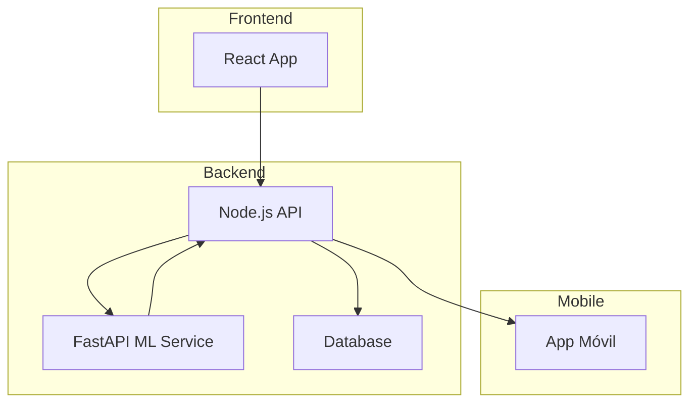

# 🛡️ Red Sentinel

[](https://opensource.org/licenses/MIT)
[](https://www.typescriptlang.org/)
[](https://www.python.org/)
[](https://reactjs.org/)
[](https://fastapi.tiangolo.com/)

**Red Sentinel** es un sistema inteligente de monitoreo de red que detecta patrones de escaneo sospechosos, predice su nivel de riesgo mediante IA y sugiere acciones de mitigación en tiempo real.

---

## 🚀 Características Principales

- 🔍 **Detección Avanzada**: Identifica patrones de escaneo tipo Nmap
- 🧠 **IA Integrada**: Clasificación de amenazas con modelos de ML
- 📊 **Dashboard en Tiempo Real**: Visualización interactiva de amenazas
- 🛡️ **Acciones Automáticas**: Recomendaciones de mitigación
- 📱 **Acceso Móvil**: Monitoreo desde cualquier lugar

---

## 🏗️ Arquitectura



### 🏗️ Microservicios

El proyecto está diseñado como una arquitectura de microservicios:

1. **API Gateway**
   - Maneja todas las peticiones entrantes
   - Autenticación y autorización
   - Rate limiting
   - Logging y monitoring

2. **Servicio de Análisis** (FastAPI)
   - Procesamiento de datos en tiempo real
   - Integración con modelos de ML
   - Clasificación de amenazas
   - Generación de recomendaciones

3. **Servicio de Notificaciones**
   - Sistema de alertas
   - Notificaciones push
   - Email y SMS
   - Integración con servicios externos

4. **Servicio de Monitoreo**
   - Métricas en tiempo real
   - Logging centralizado
   - Health checks
   - Alertas de rendimiento

5. **Servicio de Base de Datos**
   - Almacenamiento de logs
   - Historial de amenazas
   - Configuraciones
   - Estados de alertas

Cada microservicio es:
- Independiente y desacoplado
- Escalable individualmente
- Desplegable por separado
- Con su propia base de datos
- Con su propio ciclo de vida

### 📦 Stack Tecnológico

- **Backend**: Node.js + Express + TypeScript
- **IA/ML**: Python + FastAPI + Scikit-learn / TensorFlow
- **Frontend**: React + TailwindCSS + TypeScript
- **Mobile**: Android Studio (Java) / Flutter
- **Base de Datos**: MongoDB / PostgreSQL
- **Despliegue**: Vercel, Docker, GitHub Actions

---

## 🚀 API (v1)

### GET /api/health
Verifica el estado del servicio y el entorno de ejecución.

```json
{
  "status": "operational",
  "service": "Red Sentinel API",
  "version": "1.0.0",
  "uptime": "207.69 seconds",
  "timestamp": "2025-07-04T04:29:19.105Z",
  "environment": "development",
  "checks": {
    "database": "connected",
    "memoryUsage": "8.83 MB",
    "status": "ok"
  }
}
```

### POST /api/nmap
Envía datos simulados o reales de escaneo de red para evaluar riesgo.

#### Request Body

```json
{
  "ip": "192.168.1.1",
  "puerto": 22,
  "tiempo": "2025-07-04T04:59:00Z",
  "tipo": "SYN"
}
```

#### Response

```json
{
  "success": true,
  "data": {
    "riskLevel": "MEDIUM",
    "description": "Escaneo detectado desde 192.168.1.1",
    "detectedPatterns": [
      "Tipo de escaneo avanzado detectado"
    ],
    "recommendedAction": "Monitorear IP de origen"
  },
  "isThreat": false,
  "timestamp": "2025-07-04T05:04:08.343Z"
}
```

## 🧠 Inteligencia Artificial

El microservicio en Python (FastAPI):

1. Recibe datos del escaneo de red
2. Procesa el evento con un modelo de machine learning
3. Clasifica el nivel de riesgo (LOW, MEDIUM, HIGH)
4. Responde con recomendaciones automáticas según el contexto

---

## 🗺️ Roadmap

- [x] Backend Express funcional con endpoints `/health` y `/nmap`
- [ ] Microservicio IA con FastAPI
- [ ] Entrenar modelo de clasificación con logs reales o simulados
- [ ] Crear dashboard web con React para visualizar actividad
- [ ] App Android o Flutter para recibir alertas
- [ ] Dockerizar servicios para producción
- [ ] Agregar autenticación con JWT
- [ ] Automatizar todo con GitHub Actions (CI/CD)

## 🎯 Objetivo del Proyecto

Red Sentinel nace como una solución técnica y educativa para acercar la ciberseguridad inteligente a entornos reales, especialmente en países en desarrollo. El objetivo: detectar, visualizar y reaccionar ante amenazas, con herramientas open source, IA y una arquitectura moderna.

## 💬 Visión Personal

"La IA no reemplaza desarrolladores, potencia su impacto. Desde Colombia, quiero construir soluciones tecnológicas con propósito, entendiendo los problemas reales y utilizando herramientas modernas para resolverlos."
— Yonnier León

## 👨‍💻 Autor

Yonnier León
Desarrollador de Software en evolución, apasionado por la IA, la seguridad y la construcción de soluciones con impacto real.
GitHub: @YonnierDev
Desde Colombia para el mundo. 🌎🚀
